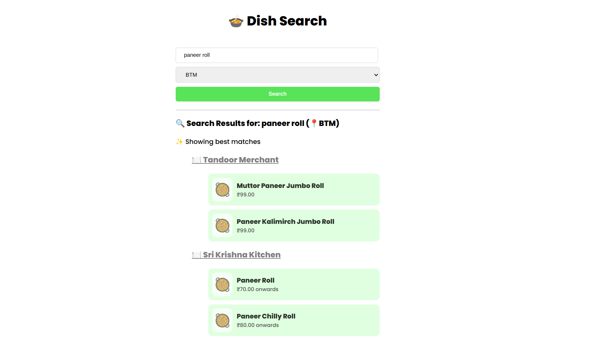

# Django Search Application



## Requirements

- Python 3.x
- Django 3.x

## Installation

1. Clone the repository:

   ```bash
   git clone https://github.com/rohitdhas/django-search-app.git
   ```

2. Change into the project directory:

   ```bash
   cd django-search-app
   ```

3. Install the project dependencies:

   ```bash
   pip install -r requirements.txt
   ```

4. Apply database migrations:

   ```bash
   python manage.py migrate
   ```

5. Load data from the CSV file into the SQLite database:

   ```bash
   python manage.py load_data
   ```

6. Start the development server:

   ```bash
   python manage.py runserver
   ```

7. Open your web browser and visit `http://localhost:8000` to access the application.

## Usage

1. Enter a search query in the search field to find restaurants that offer specific menu items.
2. Use the location dropdown to filter the results by location.
3. Click the "Search" button to perform the search.
4. The search results will be displayed, showing the names of the restaurants that match the search criteria.
